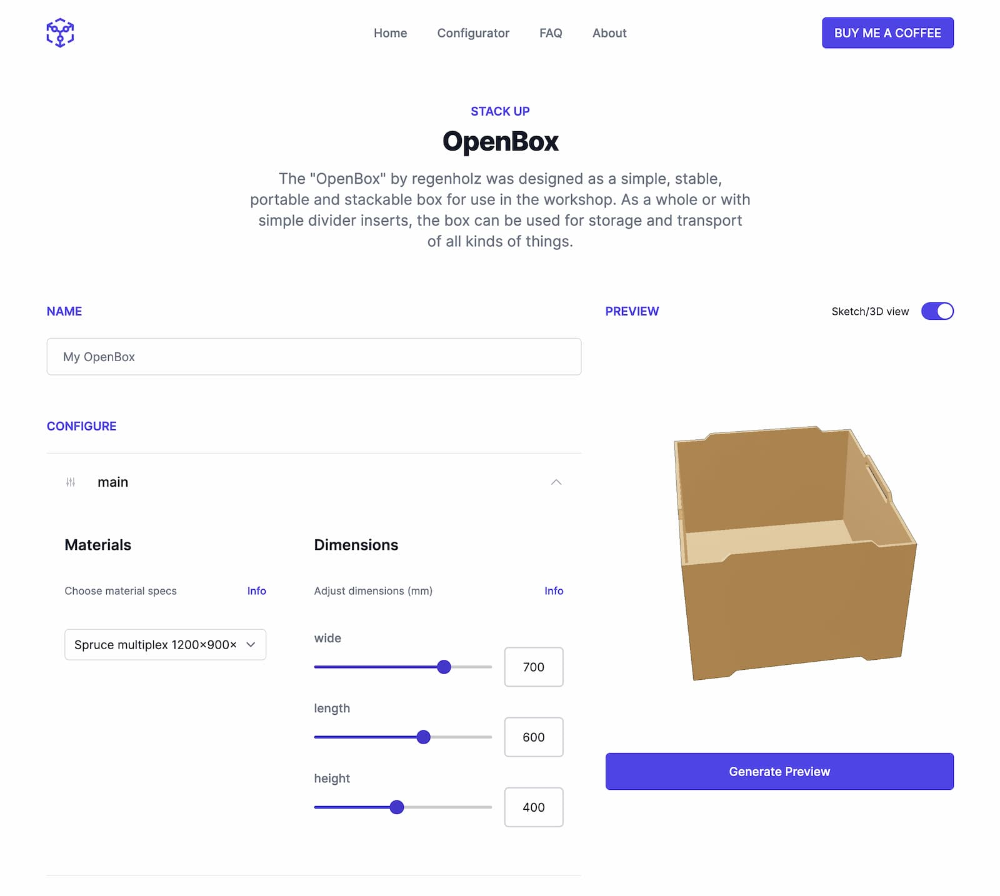

# Parameo Frontend

> Parameo is a web-based generator for parametric furniture and objects, based on an Open Source tool stack around FreeCAD. Parameo is a project by [regenholz](https://www.regenholz.de).

This repo contains only the frontend application, which is a Single Page Application based on React and Tailwind CSS. To run properly, this frontend needs a backend instance to communicate with.

## Developer setup
Requirement: Make sure you have Node.js installed locally (we suggest to use a node version manager like `nvm` or `fnm` which can pick up the right node version from the `.nvmrc` file)
- Clone the repo into a local folder via `git clone git@gitlab.regenholz.de:bat/parameo-frontend.git`
- Navigate into the newly created folder, e.g. via `cd parameo-frontend`
- Run `npm install` to install all dependencies
- Create a `.env` file (just copy the example file)
- Run `npm run dev` and see console output to open the frontend in your browser
